<p align="center">
  
</p>

# Stellar Graph

Stellar Graph is an animated 3D graph view for Obsidian vaults.
It reads your real markdown files and resolved wikilinks from Obsidian's
metadata cache, then renders them as shaded sphere nodes you can search, zoom,
rotate, filter, and click back into notes.

The plugin is built for ordinary linked-note vaults, but it is especially useful
when your vault has agent or research structure: sources, agents, skills,
briefs, decisions, logs, projects, and repo notes.

This is not a replacement for Obsidian's native graph. It is a second view for
people who want a more visual way to inspect a vault without giving up local
markdown, local files, or Obsidian's built-in graph.

## Demo

Watch the demo on YouTube:

https://www.youtube.com/watch?v=GnMS8Vasv9w

The project README intentionally does not commit screenshots, GIFs, or vault
captures so the open-source repository stays focused on the plugin build and
contains no private note content.

## Quick Start

### Manual Installation

Download the release files matching the version in `manifest.json`:

- `main.js`
- `manifest.json`
- `styles.css`

Create this folder in your vault:

```text
<vault>/.obsidian/plugins/stellar-graph/
```

Copy the three release files into that folder, then enable Stellar Graph:

```text
Settings -> Community plugins -> Installed plugins -> Stellar Graph
```

Open it from the ribbon icon or command palette:

```text
Open Stellar Graph
```

## Features

- animated 3D sphere projection
- spatial clustering and shaded sphere nodes colored by inferred note category
- floating section labels with per-category counts
- interactive controls for search, theme, mode, pause, reset, labels, focus, speed, drag rotation, and wheel zoom
- jump navigation for groups such as agents, skills, sources, concepts, projects, and briefings
- larger default controls and adjustable canvas label size
- themes: Night, Sunset, Pixelwave, Win 3.1, and XP Field
- settings for display name, default mode, default theme, and starter wizard
- sparse-vault wizard for creating a basic Obsidian graph or an agentic starter graph
- reduced-motion setting and adaptive/manual render budget for large vaults
- in-graph Auto/Manual node budget controls for high-end machines
- live links from Obsidian's metadata cache
- hover labels
- click a node to open the note
- ribbon icon and command palette command
- no remote calls and no external service dependency

## Themes

- **Night**: dark operational map for everyday research.
- **Sunset**: saturated orange-to-purple gradient with warm links and glows.
- **Pixelwave**: neon voxel graph with cyber-grid motion.
- **Win 3.1**: hard-edged 16-color windows and 8-bit-style icons.
- **XP Field**: blue-sky/green-ground desktop with glossy 32-bit-style icons.

## Navigation

Use the graph controls to move quickly without hunting:

- `Jump` selects a node group.
- `Prev` and `Next` step through the most connected/recent nodes in that group.
- `Zoom +` and `Zoom -` change camera scale.
- `Text +` and `Text -` adjust canvas label size.
- `Auto/Manual` and the node-count box control how many nodes are represented.
- Mouse wheel zooms deeply for inspection.
- Drag rotates the graph.

## Works With Existing Vaults

Open Stellar Graph in any vault that already has markdown files and wikilinks.
The plugin reads Obsidian's existing graph data from the metadata cache; it does
not require import, sync, cloud indexing, or a separate database.

If the vault is sparse, Stellar Graph can show a starter wizard that creates a
small linked graph. The wizard can create either a basic Obsidian graph or an
agentic coding graph with agents, skills, sources, and briefings. The wizard
shows the files it will create and asks for confirmation before writing notes.

## Large Vaults

Stellar Graph uses an adaptive render budget by default. It estimates a safe
visible-node count from browser/device signals such as CPU cores, device memory,
pixel density, and GPU renderer hints. High-end desktops can switch to Manual
mode in settings and raise the visible-node cap much higher.

## Why This Exists

Stellar Graph came out of a Visioncoding workflow. Lightbrush is a digital art
studio, not a traditional software shop, and this plugin was built while using
agentic coding tools to manage a real Obsidian knowledge base.

That matters because the problem was not "can we make a pretty graph?" Existing
plugins already do a lot of good graph work. The problem was simpler and more
annoying: once agents, research notes, source folders, and recurring briefs
start touching the same vault, the graph needs to show roles, not just dots.

The long-term goal is provenance you can actually use:

- where an idea came from
- which source notes fed a brief
- which decisions came out of a research cluster
- which agents, skills, or repo notes are connected to the work
- which parts of the vault are active, stale, isolated, or overloaded

Version 0.1 is the first pass at that. It is local-first, dependency-free, and
honest about what it is: a visual layer on top of Obsidian's existing metadata,
with agent/research heuristics where your vault structure supports them.

Created with love by Lightbrush, TaoBot, and Digi-Dali.

## Credits And Inspiration

Stellar Graph stands on a lot of prior work in the Obsidian, personal knowledge
management, and agentic coding communities.

- [Obsidian](https://obsidian.md/)'s native graph view inspired the core idea of
  seeing linked markdown as a navigable knowledge map.
- [CyrilXBT](https://x.com/cyrilXBT)'s articles and threads about Obsidian +
  Claude Code introduced us to the practical technique of using an LLM-maintained
  Obsidian vault that compounds through ingest, query, linting, and daily briefs.
- [Andrej Karpathy's LLM Wiki pattern](https://gist.github.com/karpathy/442a6bf555914893e9891c11519de94f)
  shaped the idea of raw sources, generated wiki pages, schema files, indexes,
  and logs as a persistent markdown knowledge system.
- Existing Obsidian graph plugins such as 3D Graph New, Three D Graph View,
  Extended Graph, Juggl, Graph Analysis, Deterministic Graph View, InfraNodus AI
  Graph View, and Agent Skill Graph are important prior art. Stellar Graph is
  not claiming to be the first 3D graph, animated graph, or AI graph for
  Obsidian.

This release does not vendor code from those projects. The current plugin is a
standalone Obsidian plugin built around local metadata-cache rendering and
agentic vault heuristics.

## Privacy

Stellar Graph reads local markdown files, file paths, frontmatter, and resolved
wikilinks through Obsidian's plugin API. It does not make network requests,
create accounts, sync data, or send vault content to an external service.

The sparse-vault starter wizard can create sample notes and folders inside the
current vault, but only after showing the planned files and asking for
confirmation.

## Differentiation

Stellar Graph should not be described as the first 3D graph for Obsidian. It is
not. Existing plugins already cover 3D note graphs, spherical layouts, timelapse
views, graph metrics, and deep graph customization.

The difference is the job it is trying to do.

Most graph plugins are great at this question:

> What does my note network look like?

Stellar Graph is aimed at a second question:

> What kind of work is this vault doing?

### Compared with general 3D graph plugins

General 3D graph plugins are useful for browsing notes as nodes and links. They
usually treat every note as roughly the same kind of object, then add graph
navigation features such as zoom, rotation, filters, search, pinning, saved
layouts, or graph metrics.

Stellar Graph keeps the animated graph experience, but adds simple vault-role
heuristics on top:

- source notes are different from project notes
- agents are different from skills
- briefings are different from logs
- decisions are different from concepts
- GitHub/repository notes are different from ordinary notes

That typing is what makes the graph more useful for agent-heavy vaults. A vault
maintained by humans and LLM agents is rarely just a pile of notes. It has raw
inputs, generated summaries, briefs, tasks, decisions, projects, and logs.
Stellar Graph tries to make those roles visible without requiring a cloud
service or a separate database.

### Provenance, not just navigation

Obsidian already handles "click a node and open a note." Stellar Graph is
designed around the next layer:

- What raw source did this idea come from?
- Which notes became a brief?
- Which decisions came out of a research cluster?
- Which agents or skills are connected to this workflow?
- Which parts of the vault are active, stale, isolated, or overloaded?

That makes it closer to a local research map than a pure graph viewer.

### Built for LLM-maintained wikis

The plugin assumes a vault may be maintained by coding agents or research agents
over time. That is why it includes heuristics for sources, agents, skills,
briefings, decisions, logs, projects, and systems.

This matters when your vault is being used as:

- a persistent LLM wiki
- a daily or weekly briefing archive
- a source-to-synthesis research system
- a project memory layer for agentic coding
- a local knowledge base that should not require a cloud graph service

### Local-first by default

Stellar Graph reads Obsidian's local metadata cache and markdown files through
the Obsidian plugin API. The current release does not call an LLM, remote graph
database, telemetry service, or external indexing API.

LLM insight panels, richer provenance schemas, and external integrations may be
added later, but they should remain explicit opt-in features.

### Simple positioning

Stellar Graph is an animated local graph view for Obsidian vaults that are used
with AI agents, research briefs, source tracking, and coding workflows.

## Local Development

Validate the plugin files:

```powershell
npm run validate
```

Prepare release assets in `dist/stellar-graph/`:

```powershell
npm run prepare:dist
```

## Release Assets

An Obsidian community plugin release needs:

- `main.js`
- `manifest.json`
- `styles.css`
- optional convenience zip: `dist/stellar-graph-<version>.zip`

## Roadmap

- persistent layout state and saved theme per vault
- touch/mobile support before changing the manifest from desktop-only
- true provenance schema instead of folder/frontmatter heuristics
- filters for source notes, agents, skills, briefings, and orphan notes
- provenance mode for source-to-brief lineage
- optional WebGL renderer with real mesh spheres and camera controls

## License

MIT
